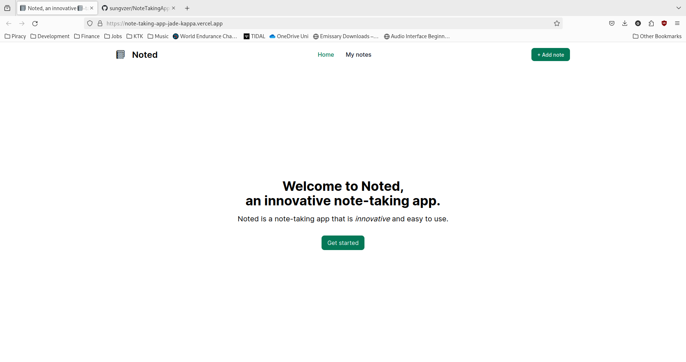

# 3Bee Note-Taking App

## Project Description

This is a note-taking app that allows users to create, edit, and delete notes. The app is built with Next.js + Tailwind CSS.

To add a note, click the "Add Note" button on the top nav bar.

To edit a note, click the "Edit" button in the "My notes" page.

To delete a note, click the "Delete" button in the "My notes" page.

The app is responsive and works on mobile devices too.

## Deployments

See the app live on [Vercel](https://note-taking-app-jade-kappa.vercel.app/).



## Prerequisites

- [Node.js](https://nodejs.org/en/) 20
- [pnpm](https://pnpm.io/)
- [nvm](https://github.com/nvm-sh/nvm) (optional)

## Getting Started

Install the dependencies:

```bash
pnpm install
```

Then, run the development server:

```bash
pnpm dev
```

Open [http://localhost:3000](http://localhost:3000) with your browser to see the result.
